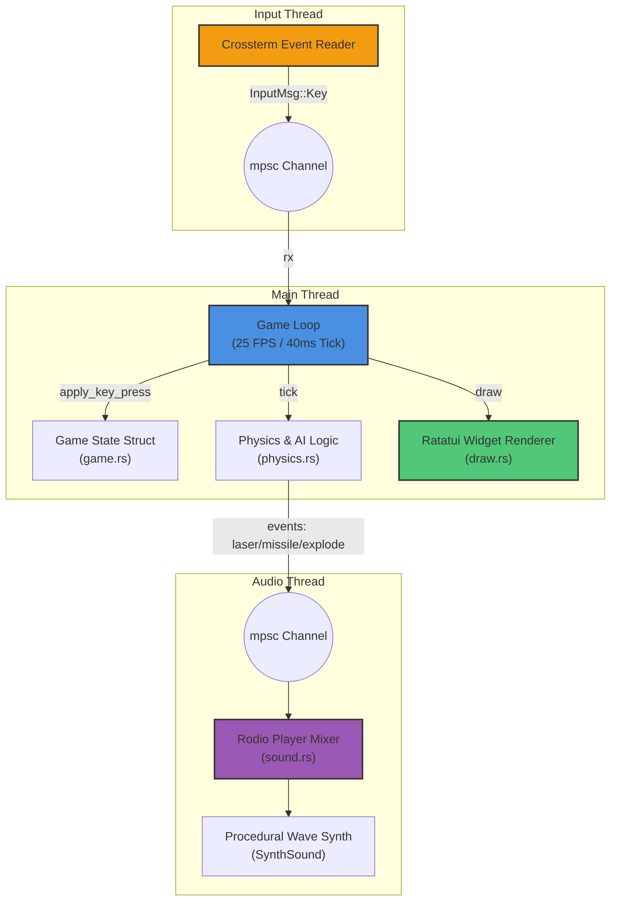

# 🦀 Rungling Bay: Architecture & System Design

**Rungling Bay** is a terminal-based tactical helicopter combat simulation written in Rust. It is ported from the original Go implementation, **[Gobungle](https://github.com/mdfranz/gobungle)**. This document outlines the high-level system design, threading architecture, memory optimizations, and key differences from the precursor Go codebase.

---

## 🗺️ System Architecture

Rungling Bay separates terminal rendering, audio playback, and user input into decoupled threads that communicate via asynchronous channels (`std::sync::mpsc`). This multi-threaded layout prevents frame-rate stutters and ensures a deterministic 25 FPS (40ms ticks) physics simulation.



---

## 🛠️ Key Architectural Refactorings (Go vs. Rust)

Porting the game to Rust required several adjustments to satisfy the borrow checker and maximize performance:

### 1. Algebraic Lock-On Targets (Borrow Checker Resolution)
*   **Go Architecture**: The precursor stored active pointer references directly on the game state (e.g., `lockedBoat *Boat`). In Rust, this would result in severe borrow conflict scenarios (mutating the list of boats while holding a reference to one).
*   **Rust Architecture**: Refactored in [types.rs](./src/game/types.rs) into a type-safe enum `LockedTarget` storing vector indexes:
    ```rust
    pub enum LockedTarget {
        None,
        Boat(usize),
        Factory(usize),
        Tank(usize),
        StaticAA(usize),
    }
    ```
    This completely eliminates pointer aliasing issues, assuring 100% compile-time memory safety.

### 2. Allocation-Free Object Pooling
*   **Go Architecture**: Projectiles (bullets and missiles) were appended to dynamic slices. This incurred garbage collection and heap allocation overhead during intense combat.
*   **Rust Architecture**: Uses fixed-capacity collections for active projectiles. The game loops in [game.rs](./src/game/game.rs) reuse inactive slot allocations in-place, capping runtime heap allocation.

### 3. Threaded Audio Synthesis
*   **Go Architecture**: Audio was synthesized on-the-fly using standard blocking calls in a flat design.
*   **Rust Architecture**: Spawns a dedicated audio dispatcher thread. Procedural C64 waveforms are computed using a custom `SynthSound` that implements `rodio::Source`. It generates mono wave samples (sweep frequencies, noise, sine waves) on-demand, rate-limiting repeat triggers within 60ms to prevent sound clipping.

---

## 🗂️ Module Layout & File Responsibilities

The codebase resides in [src/](./src):

*   [src/main.rs](./src/main.rs) — Core entry point. Initializes terminal raw modes, spins up the background threads (audio and keyboard input), and orchestrates the main 25 FPS timing loop.
*   [src/game/mod.rs](./src/game/mod.rs) — Houses the package modules and defines world constants.
*   [src/game/types.rs](./src/game/types.rs) — Declares sprite tables, motion vector offsets, structural type definitions (e.g., `Helicopter`, `Carrier`, `Boat`), and targeting enums.
*   [src/game/game.rs](./src/game/game.rs) — Defines the `Game` state struct, entity spawning rules, and projectile memory buffers.
*   [src/game/physics.rs](./src/game/physics.rs) — Orchestrates kinematic calculations (velocity, acceleration, momentum, friction), entity AI behaviors, and bounding-box (AABB) collision checks.
*   [src/game/input.rs](./src/game/input.rs) — Decodes keyboard events from Crossterm, handles targeting scans, and structures unused joystick state schemas.
*   [src/game/draw.rs](./src/game/draw.rs) — Renders the game space. Implements a custom Ratatui `Widget` which performs low-level cell writes to prevent terminal flashing.
*   [src/game/sound.rs](./src/game/sound.rs) — Generates real-time audio waveforms (explosion noise, laser sweeps, helicopter slap) using a local Linear Congruential Generator (`Lcg`) to avoid standard library locking.

---

## 🔬 Core Subsystems

### 1. Kinematics & AI Loop
The simulation updates position and velocities on a fixed interval of **40 milliseconds**. Helicopter motion incorporates realistic vector additions:
$$\vec{v}_{next} = \vec{v}_{current} + \vec{a} \cdot \Delta t$$
To replicate flight dynamics, air friction is simulated by applying a drag coefficient factor each tick:
$$\vec{v}_{drag} = \vec{v}_{next} \cdot (1 - \text{drag})$$
Enemy AI patterns (patrolling, rotating turret coordinates, and launching countermeasures) are computed immediately after.

### 2. Audio Waveform Synthesizer
The custom `SynthSound` source generates waves dynamically based on the requested `SoundType`:
*   **Laser**: High frequency sweep dropping rapidly.
*   **Warning**: Oscillating alert tone.
*   **Explosion**: Pseudo-random white noise generated with a fast, deterministic local LCG generator to keep compilation fast and lock-free.
*   **Speedboat**: Engine frequency slap sweeps.

### 3. Rendering Pipeline
The screen-buffered terminal rendering uses **Ratatui**. Rather than compiling structured layout columns, [draw.rs](./src/game/draw.rs) writes characters and color styles to specific coordinates in a single `Buffer` block:
```rust
buffer.get_mut(x, y).set_char(symbol).set_fg(color);
```
Ratatui diffs this buffer against the prior frame to flash only the modified cells, resulting in stutter-free terminal drawings.

### 4. Camera Viewport & Scrolling
The camera tracks the player's helicopter dynamically, shifting only when the helicopter approaches the screen boundaries. It maintains horizontal and vertical margins around the viewport, allowing local maneuvers without constant scrolling. The coordinates are clamped to the world boundary map to prevent rendering empty space.

