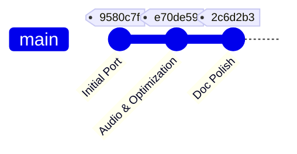

# 🦀 Rungling Bay: Rust Port Chronological History

This document tracks the chronological history and architectural evolution of porting the terminal-based tactical helicopter game **Gobungle** (Go) to **Rungling Bay** (Rust).

---

## 🗺️ Project Linage & Repository Overview

The game evolved across two distinct codebase repositories:

1. **Go Precursor (`gobungle`)**: Developed between May 30 and June 3, 2026 (17 commits). Built using `tcell` for terminal cell drawing, `beep` for audio synthesis, and raw `/dev/input/js0` file reads for Linux joystick events.
2. **Rust Port (`rungling-bay`)**: Developed on June 13, 2026 (3 commits). Ported to a clean, safe, and concurrent Rust architecture using `ratatui` (for screen buffering and diffing), `rodio` (for audio synthesis and mixing), and channel-based thread communication.

---

## 🛠️ Port Phases & Planned Blueprint

As outlined in [RUST-PORT.md](file:///home/mdfranz/github/rungling-bay/RUST-PORT.md), the port was structured into seven logical phases to maintain testability and visual parity:

*   **Phase 1: Cargo Workspace & Project Setup** — Dependency setup (`ratatui`, `crossterm`, `rodio`, `tracing`, `rand`).
*   **Phase 2: Domain Types Translation** — Porting Go entity structures to Rust structs, translating constants.
*   **Phase 3: Sound Engine & Synthesizer** — Implementing custom `rodio::Source` generators for procedural audio.
*   **Phase 4: Core Physics & AI Logic** — Mapping movement formulas and enemy AI update sequences.
*   **Phase 5: Collision Detection** — Translation of axis-aligned bounding box (AABB) checks.
*   **Phase 6: Input Systems** — Multi-threaded event readers for keyboard inputs.
    > [!IMPORTANT]
    > While joystick state sampling and handling logic are implemented in [apply_joystick_input](file:///home/mdfranz/github/rungling-bay/src/game/input.rs#L178), joystick support is currently **unused/inactive**. The background thread reading the Linux `/dev/input/js0` device node has not been spawned in [main.rs](file:///home/mdfranz/github/rungling-bay/src/main.rs).
*   **Phase 7: Rendering Engine** — Visual porting of cockpit telemetry, terrain tiles, and sprites to a custom Ratatui widget.

---

## 📅 Chronological Timeline & Feature History

### 1. Precursor Era: Go Implementation (May 30 – June 3, 2026)
*   **Phase 1: Foundation & Docs** (May 30) — Established scaffold and design parameters.
*   **Phase 2: Package Modularity** (May 30) — Refactored flat Go files into modular structure.
*   **Phase 3: Core Gameplay & Scrolling** (May 30) — Added camera dead-zones, scrolling world, enemy spawning, and HUD gauges.
*   **Phase 4: Platform Audio** (May 30) — Integrated native ALSA/macOS sound playback.
*   **Phase 5: Gameplay Polish** (June 3) — Tuned helicopter physics, gunboat AI, and weapons systems.

---

### 2. The Rust Port: Commit-by-Commit Evolution (June 13, 2026)

All porting work was committed in a single day, divided into major architectural milestones:



#### 📍 Commit 1: Initial Port (`9580c7f`)
*   **Timestamp**: June 13, 2026, 18:46:36 -0400
*   **Milestones Met**: Phase 1, 2, 4, 5, 6 (partial - keyboard only), and 7.
*   **Features & Architecture Added**:
    *   **Scaffolding**: Configured `Cargo.toml` and `.gitignore`.
    *   **Domain Models**: Ported the 12 entity types (`Carrier`, `Helicopter`, `Boat`, `Missile`, etc.) from Go into [types.rs](file:///home/mdfranz/github/rungling-bay/src/game/types.rs).
    *   **Lock-on Target Safety**: Refactored the unsafe pointer cache from Go (`lockedBoat *Boat`) into a tagged enum (`LockedTarget`) with entity indices, completely resolving borrow-checker conflicts.
    *   **Physics Loop & AI**: Ported `updatePhysics()`, helicopter dynamics, enemy AI state machines, and AABB collision checks into [physics.rs](file:///home/mdfranz/github/rungling-bay/src/game/physics.rs).
    *   **Rendering**: Implemented a single full-screen custom `Widget` in [draw.rs](file:///home/mdfranz/github/rungling-bay/src/game/draw.rs) utilizing `ratatui::buffer::Buffer`. Rather than using layout containers, it writes symbols cell-by-cell to perfectly match `tcell` aesthetics.
    *   **Main Game State & Loop**: Configured [game.rs](file:///home/mdfranz/github/rungling-bay/src/game/game.rs) and [main.rs](file:///home/mdfranz/github/rungling-bay/src/main.rs) with a 25 FPS (40ms) tick deadline.

#### 📍 Commit 2: Audio, Memory Optimization & Testing (`e70de59`)
*   **Timestamp**: June 13, 2026, 21:08:21 -0400
*   **Milestones Met**: Phase 3, 6 (complete - joystick logic structured but unused), and Testing.
*   **Features & Architecture Added**:
    *   **Procedural Audio Synthesizer**: Implemented [sound.rs](file:///home/mdfranz/github/rungling-bay/src/game/sound.rs). Created a custom `SynthSound` that implements `Iterator` and `rodio::Source`. It generates mono waveforms (sine waves, sweep frequencies, engine slap, and noise) entirely on the fly.
    *   **Deterministic Noise Generation**: Created a local linear congruential generator (`Lcg`) inside the audio generator to generate explosion and laser noise deterministically, avoiding expensive global `rand::random()` calls in the hot audio loop.
    *   **Threaded Audio Dispatcher**: Launched a dedicated background thread in [main.rs](file:///home/mdfranz/github/rungling-bay/src/main.rs) that receives sound requests via `std::sync::mpsc`. Implemented a 60ms rate-limiter to prevent duplicate sound floods.
    *   **Object Pooling**: Refactored `Game` collections (`bullets`, `missiles`, `drones`) in [game.rs](file:///home/mdfranz/github/rungling-bay/src/game/game.rs) to reuse inactive elements in-place. This caps vector allocations (16 player bullets, 24 enemy bullets, 16 missiles) to prevent runtime heap allocation stutters.
    *   **Idiomatic Refactoring**: Cleaned up physics and targeting loops using modern Rust patterns (clamping, option filtering, matches).
    *   **Unit Tests**: Added three test suites to `physics.rs` covering collision detection (`test_aabb_collision`), lock-on selection (`test_get_locked_target`), and helicopter movement (`test_helicopter_movement`).
    *   **Documentation Guide**: Added [RUST-GUIDE.md](file:///home/mdfranz/github/rungling-bay/RUST-GUIDE.md) to serve as a curriculum mapping standard Rust constructs to their implementation in this game.

#### 📍 Commit 3: Link Fixes (`2c6d2b3`)
*   **Timestamp**: June 13, 2026, 21:12:26 -0400
*   **Features & Architecture Added**:
    *   **Documentation Polish**: Corrected references and links in `RUST-GUIDE.md` for accurate documentation browsing.

---

## 📊 File-by-File Porting Mapping

The Rust port consolidated some of Go's architectural components (such as combining collision detection and AI logic directly into `physics.rs`):

| Go File (Source) | Rust File (Target) | Core Purpose | Changes/Refactoring Made |
| :--- | :--- | :--- | :--- |
| `cmd/gobungle/main.go` | [src/main.rs](file:///home/mdfranz/github/rungling-bay/src/main.rs) | Entry point, CLI init, OS terminal mode | Added multi-threaded mpsc channels for input/audio; integrated file-based `tracing`. Joystick reader is currently omitted. |
| `internal/game/types.go` | [src/game/types.rs](file:///home/mdfranz/github/rungling-bay/src/game/types.rs) | Struct fields, sprite matrices, direction tables | Introduced algebraic enum `LockedTarget` for borrow safety. |
| `internal/game/game.go` | [src/game/game.rs](file:///home/mdfranz/github/rungling-bay/src/game/game.rs) | State initializer, spawn systems | Replaced vector appends with object pooling algorithms. |
| `internal/game/physics.go` | [src/game/physics.rs](file:///home/mdfranz/github/rungling-bay/src/game/physics.rs) | Tick execution, movement math, game phase rules | Preserved original execution order; added inline testing. |
| `internal/game/enemies.go` | [src/game/physics.rs](file:///home/mdfranz/github/rungling-bay/src/game/physics.rs) | Land/water enemy routines, weapon timers | Combined with main physics module for cleaner `&mut self` mutations. |
| `internal/game/collision.go` | [src/game/physics.rs](file:///home/mdfranz/github/rungling-bay/src/game/physics.rs) | AABB entity intersection checks | Ported to functional iterator checks. |
| `internal/game/input.go` | [src/game/input.rs](file:///home/mdfranz/github/rungling-bay/src/game/input.rs) | Keyboard mapping, joystick states | Input state mapping updated via non-blocking crossterm events. Joystick state maps are defined and processed but unpopulated. |
| `internal/game/draw.rs` | [src/game/draw.rs](file:///home/mdfranz/github/rungling-bay/src/game/draw.rs) | Map/Entity cell buffer printing | Ported to custom full-screen Ratatui widget. |
| `internal/game/sound.go` | [src/game/sound.rs](file:///home/mdfranz/github/rungling-bay/src/game/sound.rs) | Audio device initiation, math sweeps | Replaced `beep` with custom `rodio` synthesizers. |

---

## 🧪 Current Verification Status

The Rust implementation currently compiles and successfully passes its core engine test suite:

```bash
cargo test
```
*   **`test_aabb_collision`**: Verification of collision boundaries.
*   **`test_get_locked_target`**: Verifies targets in helicopter sightline are correctly prioritized, and targets behind are ignored.
*   **`test_helicopter_movement`**: Verifies momentum, friction, and velocity integrations.
