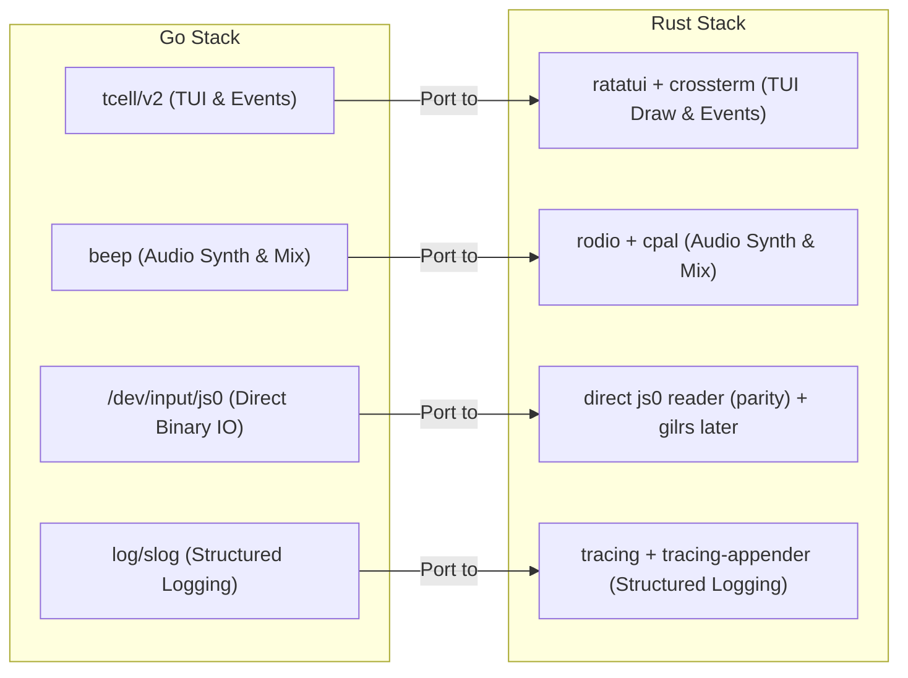

# 🦀 Gobungle Rust Porting Plan

This document outlines the detailed architectural blueprint and library research for porting **Gobungle** from Go to Rust. The goal is to retain the original game's terminal aesthetics, momentum-based physics, and C64-style software audio synthesis while leveraging Rust's safety, performance, and concurrency mechanisms.

---

## 📚 Library Research & Equivalents

Porting a Terminal User Interface (TUI) game with custom procedural audio synthesis and hardware controller support requires mapping the Go dependencies to their Rust ecosystem counterparts.



### 1. Terminal UI & Event Handling
In Go, the game uses [tcell/v2](https://github.com/gdamore/tcell) for low-level screen buffer manipulation (`SetContent`, `Show`) and event polling (`PollEvent`).

**Important context for this codebase:** [`draw.go`](../gobungle/internal/game/draw.go) does *everything* with cell-by-cell `screen.SetContent(x, y, rune, nil, style)` calls followed by a single `screen.Show()` per frame. It uses **none** of tcell's higher-level machinery — no widgets, no layout containers. The HUD, gauges (`█`/`░` strings built by hand), radar, and modal boxes are all manual cell painting. The single tcell feature the game actually depends on beyond raw escape codes is:

> `Show()` diffs the new cell buffer against the previously displayed one and emits escape codes only for the cells that changed — preventing flicker and escape-code flooding during the 25 FPS full-screen redraw.

This shapes the library choice. The decision is **not** "ratatui vs crossterm for widgets" — we will not use widgets either way. It is "do we want a ready-made diffing cell buffer, or do we hand-roll one on raw crossterm?"

*   **[Crossterm](https://crates.io/crates/crossterm)**: A cross-platform terminal manipulation library (raw mode, key/resize events, cursor moves, color). It replaces the low-level event handling in `tcell`, but it does **not** provide a diffing flush — with crossterm alone you either redraw the whole screen every tick (flicker risk + escape-code flood) or write your own front/back cell-buffer differ (~60 lines reimplementing tcell's core `Show()` behavior).
*   **[Ratatui](https://crates.io/crates/ratatui)** (recommended, used as a diffing buffer only): Provides a `Buffer` of styled cells plus `Terminal::draw`, which diffs against the previous frame and flushes only changed cells — the direct analog of tcell's `SetContent`/`Show`. We port `draw.go` by implementing a **single full-screen custom `Widget`** (see [example 3](#3-screen-drawing-cell-by-cell-mapping)) that writes into `buf` cell-by-cell, mechanically mirroring each `SetContent` call. We deliberately ignore the entire widget/layout framework (`Paragraph`, `Gauge`, `Layout`, etc.) — the HUD stays manual.

> [!TIP]
> **Choose crossterm-only** if minimizing dependencies matters more than owning ~60 lines of buffer-diff logic. **Choose ratatui** (the recommendation) for the lowest-risk, most mechanical port — `Terminal::draw` gives you the `Show()` equivalent for free, and the cell-write API maps 1:1 onto `SetContent`.

### 2. Audio Synthesis & Playback
The Go codebase utilizes [beep](https://github.com/gopxl/beep) to initialize a sound device and mix procedural audio channels. The sound effects in [`sound.go`](../gobungle/internal/game/sound.go) are mathematically synthesized on-the-fly inside the `Stream` method of the `SynthSound` struct (sweeping frequencies, noise generators, envelope shapes).

For Rust, the equivalent setup is **Rodio** on top of **CPAL**:
*   **[Rodio](https://crates.io/crates/rodio)**: A high-level audio playback library. It allows playing sounds via a thread-safe output handler and supports custom audio generators by implementing the `Source` and `Iterator` traits.
*   **[CPAL](https://crates.io/crates/cpal)**: The low-level audio hardware abstraction crate used by Rodio. We do not need to call CPAL directly, as Rodio wraps all hardware device setup and mixing, similar to Beep.

**Exact behavior to mirror from `sound.go`:**
*   **Five sound types**, each with a fixed duration and volume: `warning` (500 ms, 0.20), `laser` (55 ms, 0.28), `missile` (400 ms, 0.20), `explosion` (800 ms, 0.38), `speedboat` (300 ms, 0.18). The synthesis math (sweeps, gating, noise+sub-bass) is in the `Stream` switch — copy it verbatim.
*   **Stereo, but L == R.** Go fills `samples[i][0]` and `[1]` with the identical value. A Rust `Source` with `channels() = 1` (mono) is behaviorally equivalent and simpler — Rodio handles up-mixing. Don't reproduce the stereo duplication.
*   **Rate limiting:** Go drops a repeat of the *same* sound type within **60 ms** (note: the code comment says 80 ms but the actual threshold is `60*time.Millisecond` — port the code, not the comment). Keep a `HashMap<SoundType, Instant>` behind a `Mutex` in the audio module.
*   **Graceful fallback:** if device init fails, set a `sound_enabled = false` flag and make play a no-op (matches `InitSound`'s silent-mode fallback).
*   Go calls `rand.Float64()` per sample inside the hot loop; the Rust sketch in §1 of "Technical Code Mapping" notes a cheaper per-sound RNG — functionally either is fine since the original is noise-based.

### 3. Controller / Joystick Input
The Go implementation in [`game.go`](../gobungle/internal/game/game.go#L267-L321) reads directly from the Linux `/dev/input/js0` device node, parsing a 4-byte timestamp, 2-byte value, 1-byte type, and 1-byte axis/button number.

> [!IMPORTANT]
> **Model mismatch — the original is state-sampled, not event-driven.** The joystick reader thread keeps two maps (`joystickAxes[number]→int16`, `joystickButtons[number]→bool`) and `applyJoystickInput()` *samples those maps every physics tick*. The game logic depends on **raw Linux `js0` axis/button indices**: axes `0,1` (left stick), `4` (right-stick Y throttle), `5` (guns trigger), `6,7` (dpad); buttons `0` (A/land), `1,3,7` (missile), `2,6` (cannon) — each axis divided by `32767.0`. These are hardware-raw indices, **not** gilrs's normalized logical buttons.

For Rust, two paths with a real tradeoff:
*   **Direct File Reading (recommended for first-pass parity)**: A 1:1 port — open `/dev/input/js0` with `std::fs::File`, read 8-byte events, decode `time: u32` and `value: i16` with `from_le_bytes`, and update the same index→value / index→bool state maps that the tick loop samples. This reproduces the exact control mapping with zero re-calibration and stays Linux-only (which the game already is). The `cmd/controller-recorder` tool and the captured `events.txt`/`lsusb.txt` in the repo document the expected event stream.
*   **[Gilrs](https://crates.io/crates/gilrs) (better portability, needs re-mapping)**: Cross-platform, hotplug, deadzones, logical button mapping. But because it's **event-based with logical codes**, you must (a) maintain your own axis/button state map updated from `Gilrs::next_event` so the tick loop can still *sample* it, and (b) re-derive which gilrs `Axis`/`Button` corresponds to each raw index above (the mapping will not match the raw `js0` numbers). Recommended only as a phase-2 swap behind an `InputSource` trait once direct-file parity is verified.

### 4. Logging & Diagnostics
The Go game uses `log/slog` to write text logs to `gobungle.log`.
*   In Rust, the standard library is **[Tracing](https://crates.io/crates/tracing)** combined with **[tracing-appender](https://crates.io/crates/tracing-appender)** for non-blocking file-based logging, providing rich structured context.

---

## 🗂️ Codebase Inventory & Effort Map

The port surface is **~4,496 LOC of Go** in `internal/game/` (9 files) plus four small `cmd/` binaries. Sizing the files up front makes the sequencing obvious — `draw.go` alone is nearly a third of the code and is the long pole.

| Go file | LOC | Responsibility | Port difficulty | Notes |
| :--- | ---: | :--- | :--- | :--- |
| `draw.go` | 1428 | Terrain/entity/HUD/radar rendering | **High (tedious, not hard)** | Pure cell-painting; needs a tcell→ratatui color map. Read-only over state. |
| `physics.go` | 753 | Tick coordinator, heli dynamics, carrier defense, waves, camera, round reset | Medium | `updatePhysics()` defines the canonical tick order (see parity checklist). All `f64`. |
| `collision.go` | 514 | All hit detection + damage resolution | Medium | AABB + point/circle checks; mutates many entity slices. |
| `enemies.go` | 387 | Boat / factory / drone / tank / static-AA / stealth-boat AI | Medium | State machines + cooldown counters. |
| `input.go` | 385 | Keyboard handler, joystick sampler, lock-on scan | Medium | Lock-on borrow refactor lives here. Joystick model gotcha (see challenges). |
| `game.go` | 321 | `Game` struct, `New()`, loops, raw js0 reader | Medium | Threading model decision applies here. |
| `projectiles.go` | 301 | Bullet/missile movement, homing, CIWS, spawn helpers | Low–Medium | Mostly arithmetic + slice appends. |
| `types.go` | 228 | 12 entity structs, 8-dir vectors, sprite tables | **Low (mechanical)** | Direct struct→struct; sprite literals copy verbatim. |
| `sound.go` | 179 | Procedural synth + playback + rate limit | Medium | 5 sound types; see audio notes. |
| `cmd/*` | 368 | `gobungle` (main, 44), `soundtest`, `controller-recorder`, `flight-test` | Optional | Dev/diagnostic tools — port only if you want them. |

### The `Game` "god-object" hub — and why the port is mechanical

Almost every function is a method on `*Game` (`func (g *Game) updateBoats()`, `func (g *Game) draw()`, …) and the only shared state is the `Game` struct itself — the architecture doc calls this out explicitly ("No shared state outside the struct"). This is the single most important structural fact for the port:

> Keep **one `struct Game`** that owns every entity `Vec`, and split its `impl Game { … }` blocks across the same module files as Go (`physics.rs`, `enemies.rs`, …). Rust permits multiple `impl` blocks for one type across files in a crate, so each `func (g *Game) foo()` becomes `fn foo(&mut self)` in the matching module — a near-1:1 translation with no re-architecting.

The 12 entity types to port from `types.go`: `Carrier`, `Bullet`, `Missile`, `Boat`, `Explosion`, `Helicopter`, `Island`, `Factory`, `Drone`, `Tank`, `StealthBoat`, `StaticAA`.

### Tick-order parity checklist (from `updatePhysics()`)

Behavioral parity depends on preserving this exact order — collisions and AI read state mutated earlier in the same tick:

1. `Ticks++`
2. **Carrier-destruction branch** (early return): spawn deck explosions, `updateHelicopter`, `updateExplosions`, `updateCamera`.
3. `applyJoystickInput` → 4. `updateHelicopter` → 5. `updateCamera` → 6. `updateWeaponCooldowns` → 7. `updateCarrierDefense` → 8. `updateProjectiles` → 9. `updateBoats` → 10. `updateStealthBoats` → 11. `updateLandForces` (factories→drones→tanks→staticAA) → 12. `updateExplosions` → 13. `checkCollisions` → 14. `checkWaveCompletion` → 15. `getLockedTarget` (store result).

> [!NOTE]
> Lock-on targets are **recomputed every tick at step 15**, then read by the input layer on the next firing. This shrinks the borrow-checker problem the doc raises in §2 below: you never hold a target reference across ticks, so a single `enum LockedTarget { None, Boat(usize), Factory(usize), Tank(usize), StaticAA(usize) }` recomputed each tick is cleaner than four `Option<&T>` pointers.

---

## 🔀 Architectural Translation

### 1. Concurrency and Synchronization Models

The current Go engine uses a **shared-state multithreaded model**:
1.  **Main Thread**: Blocks on terminal input polling (`PollEvent`).
2.  **Tick Thread**: Runs at 25 FPS (40ms), performing physics and rendering.
3.  **Joystick Thread**: Continuously reads raw events from `/dev/input/js0`.
*   All threads synchronize state access via a global lock `g.mu sync.Mutex` around the `Game` struct.

While this can be replicated in Rust using `Arc<Mutex<GameState>>` (or a high-performance mutex like `parking_lot::Mutex`), Rust offers more idiomatic concurrency patterns that reduce lock contention and eliminate race conditions entirely.

#### Proposed Rust Architecture Options

```
Option A: Single-Threaded Non-Blocking Loop
┌────────────────────────────────────────────────────────┐
│                        Main Loop                       │
│  1. Check Input (crossterm::event::poll)               │
│  2. Update Game State (Physics, AI, Collisions)        │
│  3. Render Frame (ratatui::Terminal::draw)             │
│  4. Sleep remaining tick time (~40ms)                  │
└────────────────────────────────────────────────────────┘

Option B: Channel-Based Message Passing (Recommended)
┌──────────────────┐     Key/resize events      ┌──────────────────────────────┐
│ Keyboard Thread  ├────────────────────────────►│          Main Loop           │
└──────────────────┘                             │  1. Drain input messages     │
┌──────────────────┐     Axis/button events      │  2. Update InputState        │
│ Gamepad Thread   ├────────────────────────────►│  3. Sample InputState        │
└──────────────────┘                             │  4. Update physics/render    │
┌──────────────────┐        Audio command        │  5. Wait for next tick       │
│ Audio Thread     │◄────────────────────────────┤                              │
└──────────────────┘                             └──────────────────────────────┘
```

#### Comparison of Design Patterns

| Pattern | Implementation Complexity | CPU Overhead | Idiomatic Rust Rating |
| :--- | :--- | :--- | :--- |
| **Option A: Single-Threaded Event Loop** | Low | Very Low | High |
| **Option B: Channel-Based Message Passing** | Medium | Low | Very High |
| **Option C: Shared Mutex (Arc<Mutex<G>>)** | Low | High (Contention) | Low |

> [!TIP]
> **Option B (Channel-Based Message Passing)** is highly recommended. By keeping the `GameState` owned exclusively by the main thread, we eliminate the need for a game-wide mutex. The input threads should send *state changes* through `std::sync::mpsc`, not one-shot movement commands: keyboard events, resize events, and controller `AxisChanged { number, value }` / `ButtonChanged { number, pressed }` messages. The game loop drains the queue at the start of each tick, updates a persistent `InputState`, then calls the Rust equivalent of `applyJoystickInput()` so held axes/buttons remain sampled every physics tick just like the Go version.

---

## 🛠️ Step-by-Step Porting Phase Plan

### Phase 1: Cargo Workspace & Project Setup
1.  Initialize the Rust binary project in this repository: `cargo init --bin .` (or `cargo new rungling-bay --bin` if starting from an empty parent directory).
2.  Configure `Cargo.toml` with the researched dependencies:
    ```toml
    [package]
    name = "rungling-bay"
    version = "0.1.0"
    edition = "2024"

    [dependencies]
    ratatui = "0.30"
    crossterm = "0.29"
    rodio = "0.22"
    gilrs = "0.11" # phase 2 controller backend; direct js0 parity comes first
    tracing = "0.1"
    tracing-appender = "0.2"
    rand = "0.10"
    ```

    If you intentionally pin older crates for distro compatibility, adjust the examples accordingly. In particular, Rodio 0.17 used `Source::current_frame_len`; Rodio 0.22 uses `Source::current_span_len`.

### Phase 2: Domain Types Translation
*   Port [`types.go`](../gobungle/internal/game/types.go) into `src/game/types.rs`.
*   Translate Go structs into Rust structs. Keep fields as `f64` for coordinates and vector speeds to match Go's floating-point math.
*   Translate 8-way direction vectors and dynamic sprites into static Rust arrays:
    ```rust
    pub const DIR_NAMES: [&str; 8] = ["N", "NE", "E", "SE", "S", "SW", "W", "NW"];
    pub const DX: [f64; 8] = [0.0, 0.707, 1.0, 0.707, 0.0, -0.707, -1.0, -0.707];
    pub const DY: [f64; 8] = [-0.5, -0.354, 0.0, 0.354, 0.5, 0.354, 0.0, -0.354];
    ```

### Phase 3: Sound Engine & Synthesizer
*   Port the synthesis algorithms from [`sound.go`](../gobungle/internal/game/sound.go) to `src/game/sound.rs`.
*   Implement `rodio::Source` and `Iterator` for the custom synthesizer struct.
*   Establish a global audio thread with an `mpsc` queue to queue sound play requests (Warning, Laser, Missile, Explosion, Speedboat). Add a dedicated channel crate only if the standard channel becomes a measured bottleneck.

### Phase 4: Core Physics & AI Logic
*   Port [`physics.go`](../gobungle/internal/game/physics.go) and [`enemies.go`](../gobungle/internal/game/enemies.go) to `src/game/physics.rs` and `src/game/enemies.rs`.
*   Implement the movement updates, homing algorithms, and enemy AI state machines.
*   Implement target locking logic ([`input.go`](../gobungle/internal/game/input.go#L280-L384)), mapping the pointer-caching system (e.g. `lockedBoat *Boat`) to a `LockedTarget` enum with entity indices.

### Phase 5: Collision Detection
*   Port [`collision.go`](../gobungle/internal/game/collision.go) into `src/game/collision.rs`.
*   Implement standard hitbox bounding box checks.
*   Resolve damage mutations on entities and trigger explosion particle spawns.

### Phase 6: Input Systems
*   Port [`input.go`](../gobungle/internal/game/input.go) to `src/game/input.rs`.
*   Set up keyboard handling with `crossterm::event::poll`/`read` and translate key presses into the same immediate mutations as Go's `handleKeyPress`.
*   Add an `InputState` with raw `axes: HashMap<u8, i16>` and `buttons: HashMap<u8, bool>`.
*   For first-pass controller parity, add a Linux `/dev/input/js0` reader thread that sends `AxisChanged` / `ButtonChanged` messages into the main loop. Defer `gilrs::Gilrs::next_event` until after direct-file parity is verified.

### Phase 7: Rendering Engine
*   Port [`draw.go`](../gobungle/internal/game/draw.go) to `src/game/draw.rs` as a **single full-screen custom `Widget`** (or, on crossterm-only, a function writing into your own back buffer).
*   Write a custom drawing function that iterates over the terminal coordinates, samples the terrain background color (ocean/grass/sand/road/carrier), overlays sprites, and writes symbols cell-by-cell — a near-mechanical translation of each `SetContent(x, y, r, nil, style)` into a `buf` cell write.
*   Port the cockpit HUD the same way: keep it **manual cell painting**. The gauges (armor/carrier/cannon-heat bars), radar, and modal boxes in `draw.go` are hand-built `█`/`░` strings and box-drawing characters — do **not** retrofit them onto `Paragraph`/`Gauge`/`Layout`. Doing so would be more work and would change the visual output.
*   On the diffing flush: with ratatui, `Terminal::draw` handles it (the `Show()` equivalent). With crossterm-only, this is where the hand-rolled front/back buffer differ lives — compare the new cell grid to the previous one and emit `MoveTo` + styled-write only for changed cells.

---

## 💻 Technical Code Mapping Examples

### 1. Sound Synthesis: Go vs Rust

In Go, [`sound.go`](../gobungle/internal/game/sound.go) uses a custom streamer:

```go
// Go Version
func (s *SynthSound) Stream(samples [][2]float64) (n int, ok bool) {
    // Generate samples inside the loop...
    samples[i][0] = val * s.volume
    samples[i][1] = val * s.volume
    s.time += 1.0 / float64(s.sampleRate)
}
```

In Rust, we implement the `Iterator` and `Source` traits:

```rust
// Rust Version
use rodio::Source;
use std::time::Duration;

pub struct SynthSound {
    sample_rate: u32,
    duration: Duration,
    time: f32,
    sound_type: SoundType,
    volume: f32,
    current_sample: usize,
    total_samples: usize,
}

impl Iterator for SynthSound {
    type Item = f32; // Mono stream

    fn next(&mut self) -> Option<Self::Item> {
        if self.current_sample >= self.total_samples {
            return None;
        }

        let progress = self.current_sample as f32 / self.total_samples as f32;
        let mut val = 0.0;

        match self.sound_type {
            SoundType::Laser => {
                let noise = rand::random::<f32>() * 2.0 - 1.0;
                let freq = 320.0 - 260.0 * progress;
                let tone = (2.0 * std::f32::consts::PI * freq * self.time).sin() * 0.4;
                val = 0.6 * noise + tone;
                val *= (-18.0 * progress).exp();
            }
            SoundType::Explosion => {
                let noise = rand::random::<f32>() * 2.0 - 1.0;
                let sub_freq = 30.0 * (1.0 - progress * 0.5);
                let sub_bass = (2.0 * std::f32::consts::PI * sub_freq * self.time).sin();
                let rumble = (2.0 * std::f32::consts::PI * sub_freq * 2.0 * self.time).sin();
                val = 0.55 * noise + 0.30 * sub_bass + 0.15 * rumble;
                val *= (-1.8 * progress).exp();
            }
            // Other sound types mapped similarly...
            _ => {}
        }

        self.time += 1.0 / self.sample_rate as f32;
        self.current_sample += 1;
        Some(val * self.volume)
    }
}

impl Source for SynthSound {
    fn current_span_len(&self) -> Option<usize> { None }
    fn channels(&self) -> u16 { 1 } // Mono
    fn sample_rate(&self) -> u32 { self.sample_rate }
    fn total_duration(&self) -> Option<Duration> { Some(self.duration) }
}
```

> [!NOTE]
> Two things to watch in the sketch above: (1) `rand::random()` is called per-sample inside the hot `next()` loop — at 44.1 kHz that's a lot of thread-local RNG calls; consider seeding a cheap per-sound generator once and reusing it. (2) Termination is driven by `total_samples` in `next()` (returning `None`), which is correct, but make sure `duration`/`total_samples` are derived from the same `sample_rate` so the cutoff and `total_duration()` agree.

### 2. Lock-on Pointer Safety: Index Refactoring

In Go, [`types.go`](../gobungle/internal/game/types.go) caches pointers to entities:

```go
// Go Version
type Game struct {
    boats      []Boat
    lockedBoat *Boat
}
```

Note the Go struct actually caches **four** pointers (`lockedBoat`, `lockedFactory`, `lockedTank`, `lockedStaticAA`), but `getLockedTarget()` only ever returns one non-nil — they are mutually exclusive (a single nearest target wins). So the idiomatic Rust representation is **one tagged enum**, not four `Option`s:

```rust
// Rust Version
pub enum LockedTarget {
    None,
    Boat(usize),
    Factory(usize),
    Tank(usize),
    StaticAA(usize),
}

pub struct Game {
    boats: Vec<Boat>,
    factories: Vec<Factory>,
    locked: LockedTarget,
}
```

Because the lock is recomputed every tick (tick-order step 15) and only read on the next tick's fire command, you never hold a borrow across a mutation — the index is re-validated at use:

```rust
if let LockedTarget::Boat(idx) = self.locked {
    if let Some(boat) = self.boats.get(idx) {
        if boat.active {
            // Apply homing update
        }
    }
}
```

### 3. Screen Drawing: Cell-by-Cell Mapping

Go's screen drawing uses low-level `SetContent` cell positioning:

```go
// Go Version
s.SetContent(col, row, rune, nil, style)
```

In Rust, we write directly to the buffer of a Ratatui `Widget`. **This single full-screen `Widget` is the only place ratatui is used** — there are no child widgets, no layout split; the whole `draw.go` becomes the body of one `render`:

```rust
// Rust Version
use ratatui::buffer::Buffer;
use ratatui::layout::Rect;
use ratatui::style::Style;
use ratatui::widgets::Widget;

impl Widget for &Game {
    fn render(self, area: Rect, buf: &mut Buffer) {
        // Iterate over camera coordinates and render grid
        for y in 0..area.height {
            for x in 0..area.width {
                let world_x = x as i32 + self.cam_x;
                let world_y = y as i32 + self.cam_y;
                let style = self.get_map_style(world_x, world_y);
                let symbol = self.get_symbol_at(world_x, world_y);
                
                buf.get_mut(area.left() + x, area.top() + y)
                    .set_symbol(&symbol.to_string())
                    .set_style(style);
            }
        }
    }
}
```

---

## ⚠️ Key Challenges & Considerations

> [!WARNING]
> **1. Keyboard Polling Rate and Input Ghosting**
> In TUI games, standard keyboard polling does not report "key release" events, only repeating "key press" events. Rust's `crossterm::event::read` will block unless wrapped in `event::poll`. A non-blocking poll with a small buffer is crucial to prevent input lag from compounding when multiple keys are held.

> [!NOTE]
> **2. ALSA System Dependencies on Linux**
> The `rodio` library relies on ALSA on Linux systems. Similar to Go's `libasound2-dev` requirement, building the Rust version on Linux will require installing development headers:
> *   Debian/Ubuntu: `sudo apt install libasound2-dev pkg-config`
> *   Fedora/RHEL: `sudo dnf install alsa-lib-devel pkgconfig`

> [!CAUTION]
> **3. Floating Point Precision & Determinism**
> Go's physics math operates on `float64`. Use `f64` throughout physics, camera, homing, and collision code so trajectories, velocities, and lock-on apertures match. (Audio is independent — `f32` samples there are fine and idiomatic for Rodio; the "don't mix" rule is about the *physics* path.) One subtlety in `types.go`: the 8-direction `dy` vectors are pre-scaled by `0.5` for terminal cell aspect ratio, and lock-on/AA range checks multiply `dy` back by `2.0` — preserve both factors exactly.

> [!WARNING]
> **4. The game is already non-deterministic — plan parity testing accordingly**
> The Go code uses the global `math/rand` without seeding (Go 1.20+ auto-seeds randomly each run), so explosions, CIWS intercept rolls, stealth-boat spawn timing, and smoke are different every run. You therefore **cannot** byte-diff a Go run against a Rust run. Two viable parity strategies:
> 1.  **Determinize both sides for testing**: add a seeded RNG (`StdRng::seed_from_u64`) to the Rust port and a matching `rand.New(rand.NewSource(seed))` to a Go test build, feed a scripted input sequence, and assert key state (heli position, carrier health, entity counts) tick-by-tick. Requires threading an RNG handle through the methods that currently call the global.
> 2.  **Behavioral/visual parity**: drive both with the same recorded inputs and compare aggregate outcomes (waves cleared, frames-to-game-over distributions, HUD values) rather than exact frames. Lower fidelity, far less plumbing.
> Recommend (1) for the physics/collision core and (2) for the audiovisual layer.

> [!NOTE]
> **5. Color translation: tcell → ratatui**
> `draw.go` styles cells with `tcell.ColorWhite/Red/Orange/Yellow/Green/...` and string lookups via `tcell.ColorNames["yellow"]`. Build one small `fn to_color(...) -> ratatui::style::Color` mapping table (named colors map directly; any RGB values map to `Color::Rgb`). Centralize it so the ~hundreds of style sites in `draw.go` translate mechanically. Terminal background/foreground composition (`Style::default().fg(...).bg(...)`) replaces tcell's `style.Foreground(...).Background(...)`.

---

## ✅ Recommended Build & Verification Sequence

A dependency-ordered path that keeps the project runnable and testable at each step (it deviates slightly from the numbered phases above to front-load a visible result):

1.  **Scaffold + types** (Phases 1–2): `Cargo.toml`, `Game` struct, all 12 entity types, direction/sprite tables. Compiles, does nothing.
2.  **Rendering on a static world** (Phase 7 first): port `draw.go`'s terrain + carrier + HUD against a hand-placed `Game`. Gets pixels on screen early — the most motivating and the biggest file, so start it before the sim is live. Use ratatui's `Terminal::draw` for the `Show()`-equivalent diffing flush.
3.  **Tick loop + helicopter physics** (part of Phase 4): wire the 40 ms loop and `updateHelicopter`/`updateCamera`; keyboard via `crossterm::event::poll`. Now it flies.
4.  **Enemies, projectiles, collisions** (Phases 4–5): port `enemies.go`, `projectiles.go`, `collision.go` in tick order; verify with seeded-RNG parity tests.
5.  **Lock-on + missiles** (Phase 6): `getLockedTarget` → `LockedTarget` enum, missile homing, CIWS.
6.  **Audio** (Phase 3): the synth `Source` and rate limiter. Independent of the sim — can slot in any time after step 3.
7.  **Logging + polish**: `tracing` to `gobungle.log`, game-over/quit modals, wave progression, round reset.
8.  **Joystick (last, deliberately deferred)** (Phase 6): keyboard input (step 3) makes the game fully playable, so controller support is the final subsystem. Wire the `js0` reader updating the sampled state maps once everything else is verified, keeping it behind an `InputSource` seam so the path (direct-file vs. gilrs) stays open.

> [!TIP]
> Optional `cmd/` tools (`soundtest`, `controller-recorder`, `flight-test`) are excellent **port-validation harnesses** rather than shippable features: a Rust `soundtest` confirms the synth port in isolation before wiring it into the game, and a `controller-recorder` equivalent verifies the `js0` decode. Port them opportunistically alongside the subsystem they exercise.
