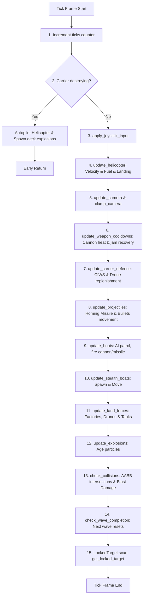

# 🦀 Rungling Bay: Detailed Implementation Specification

This document provides a comprehensive breakdown of the Rungling Bay codebase implementation, detailing the core modules, key data structures, and the flow of data and execution.

For high-level system design, threading architecture, and module structure, see [ARCHITECTURE.md](../ARCHITECTURE.md).

---

## 📁 1. Codebase Structure & Modules

The codebase is structured under [src/](.) and [src/game/](game/). For the file-by-file breakdown of layout and high-level responsibilities, please refer to the [Module Layout & File Responsibilities](../ARCHITECTURE.md#-module-layout--file-responsibilities) section in [ARCHITECTURE.md](../ARCHITECTURE.md).

---

## 📊 2. Core Data Structures & Memory Layouts

### 2.1 The `Game` State Struct
The `Game` struct (defined in [game/game.rs](game/game.rs#L8)) serves as the central state coordinator of the simulation. It owns all entities, camera settings, and I/O channels:

```rust
pub struct Game {
    pub width: i32,
    pub height: i32,
    pub world_width: i32,
    pub world_height: i32,
    pub cam_x: i32,
    pub cam_y: i32,
    pub quit_confirming: bool,
    pub game_over: bool,
    pub carrier_destroying: bool,
    pub destruction_ticks: i32,
    pub wave: i32,
    pub heli: Helicopter,
    pub carrier: Carrier,
    pub bullets: Vec<Bullet>,
    pub missiles: Vec<Missile>,
    pub boats: Vec<Boat>,
    pub initial_boats: Vec<Boat>,
    pub island: Island,
    pub factories: Vec<Factory>,
    pub drones: Vec<Drone>,
    pub tanks: Vec<Tank>,
    pub static_aas: Vec<StaticAA>,
    pub stealth_boats: Vec<StealthBoat>,
    pub stealth_spawn_at: i32,
    pub stealth_near: bool,
    pub explosions: Vec<Explosion>,
    pub lives: i32,
    pub ticks: i32,
    pub locked: LockedTarget,
    pub joystick_axes: HashMap<u8, i16>,
    pub joystick_buttons: HashMap<u8, bool>,
    pub joystick_last_btn: HashMap<u8, bool>,
    pub audio_tx: Option<std::sync::mpsc::Sender<super::sound::SoundType>>,
}
```

### 2.2 Targetable Entities & Target Resolution (`LockedTarget`)
While the design rationale and definition of the `LockedTarget` enum is detailed in [ARCHITECTURE.md](../ARCHITECTURE.md#1-algebraic-lock-on-targets-borrow-checker-resolution), the concrete system implements target queries via the `Targetable` trait defined in [game/types.rs](game/types.rs#L237):

```rust
pub trait Targetable {
    fn position(&self) -> (f64, f64);
    fn is_active(&self) -> bool;
    fn sinking_timer(&self) -> i32;
    fn to_locked_variant(index: usize) -> LockedTarget;
}
```

This trait is implemented by target entities (e.g., `Boat` in [game/types.rs](game/types.rs#L244), `Factory` in [game/types.rs](game/types.rs#L259), `Tank` in [game/types.rs](game/types.rs#L274), `StaticAA` in [game/types.rs](game/types.rs#L289)) to allow dynamic target checks and distance-based locking.

### 2.3 Object Pooling (Allocation-Free Collections)
Building on the allocation-free object pooling concept outlined in [ARCHITECTURE.md](../ARCHITECTURE.md#2-allocation-free-object-pooling), the concrete implementation details in [game/game.rs](game/game.rs) include:
- **Bullets**: Pre-allocated to `bullets: Vec<Bullet>` (capped at 16 player bullets, 24 enemy bullets).
- **Missiles**: Pre-allocated to `missiles: Vec<Missile>` (capped at 16 active missiles).
- **Drones**: Pre-allocated to `drones: Vec<Drone>` (reused slots dynamically).

When spawning, the game searches the vector for the first inactive slot and replaces it:
```rust
if let Some(slot) = self.bullets.iter().position(|bullet| !bullet.active) {
    self.bullets[slot] = new_bullet;
} else if self.bullets.len() < MAX_LIMIT {
    self.bullets.push(new_bullet);
}
```

---

## 🔄 3. System Execution & Data Flows

For the high-level threading diagram and communication channels, refer to [System Architecture](../ARCHITECTURE.md#%EF%B8%8F-system-architecture) in [ARCHITECTURE.md](../ARCHITECTURE.md).

### 3.1 Asynchronous Thread Message Processing
The threads interact via specific implementation patterns:
- **Input Thread**: Captures Crossterm key presses and window resizes asynchronously, sending `InputMsg` events to the main thread.
- **Audio Thread**: Listens for `SoundType` messages (Laser, Missile, Explosion, Warning, Speedboat). It enforces a 60ms rate-limiter for duplicate sounds and submits them to CPAL mixer sinks using Rodio.
- **Main Thread**: Controls the 25 FPS (40ms ticks) game loop, draining the input queue, applying inputs, updating the physics coordinates, and drawing the UI.

---

### 3.2 Canonical Physics & AI Execution Sequence (Tick Order Parity)
The `update_physics` method in [game/physics.rs](game/physics.rs#L17) coordinates exactly 15 sequential steps per frame:



#### Detailed Step Mechanics:
- **Helicopter Dynamics (Step 4)**: Computes kinematics by adding thrust acceleration to the velocity vector and damping it with drag (representing air friction):
  $$\vec{v}_{next} = (\vec{v}_{current} + \vec{a}) \times (1 - \text{drag})$$
- **Weapon Cooldowns (Step 6)**: Manages weapon fire rates. Firing the cannon increases heat; exceeding `MAX_HEAT` (20) triggers a barrel jam for 60 ticks and damages the helicopter.
- **Countermeasures & CIWS (Step 7 & 8)**: The carrier tracks incoming missiles and deploys CIWS. Factory-launched defense drones and carrier drones intercept incoming missiles when within a threshold of 4.0 units.
- **Homing Missiles (Step 8)**: Missiles adjust their velocity vectors to steer towards the targets represented in `LockedTarget` (Boat, Factory, Tank, Static AA).
- **Stealth Boats (Step 10)**: Fast vessels that spawn under specific conditions and sail directly to the carrier to detonate, ignoring the player.

---

### 3.3 Audio Synthesis & Linear Congruential Generator
As described in [ARCHITECTURE.md](../ARCHITECTURE.md#2-audio-waveform-synthesizer), the `SynthSound` struct in [game/sound.rs](game/sound.rs#L30) implements `rodio::Source` to synthesize audio programmatically. The implementation-specific mechanics are:
- **LCG Random Generator**: To prevent mutex locks and costly random source queries, a lightweight Linear Congruential Generator (`Lcg` in [game/sound.rs](game/sound.rs#L15)) generates deterministic pseudo-random floats for noise synthesis:
  $$X_{n+1} = (a \cdot X_n + c) \pmod m$$
  with $a = 1664525$, $c = 1013904223$, and $m = 2^{32}$.
- **Sound Wave Synthesis**:
  - **Laser**: Combined high-frequency sine wave sweep dropping exponentially overlaid with LCG noise.
  - **Explosion**: Sub-bass rumble mixed with low-frequency sine waves and heavy LCG noise, decaying exponentially.
  - **Speedboat**: Low-frequency engine slap based on sine wave oscillation and repeating noise bursts.
  - **Warning**: Oscillating alert tone gating on/off every few sample intervals.

---

### 3.4 Screen Rendering Pipeline Implementation
Building on the rendering model outlined in [ARCHITECTURE.md](../ARCHITECTURE.md#3-rendering-pipeline), the screen rendering in [game/draw.rs](game/draw.rs) uses the following low-level cell buffering technique:
- **Ratatui Cell Buffering**: Ratatui maintains a front and back buffer of `Cell` elements.
- **Manual Painting**: The rendering loops iterate over the viewport bounds `(0..area.height)` and `(0..area.width)` mapping coordinates to the world map and writing characters directly:
  ```rust
  buf.get_mut(area.left() + x, area.top() + y)
      .set_symbol(&symbol.to_string())
      .set_style(style);
  ```
- **Flicker-Free Flush**: During `Terminal::draw`, Ratatui diffs the active buffers and only outputs ANSI escape codes for modified cells.

---

## 📐 4. Collision Models & Physics Calculations

### 4.1 Bounding Box Collision (`aabb`)
Collision checks between bullets, missiles, and targets are evaluated using Axis-Aligned Bounding Box (AABB) checks implemented in [game/physics.rs](game/physics.rs#L1622):
```rust
fn aabb(ax: f64, ay: f64, bx: f64, by: f64, hw: f64, hh: f64) -> bool {
    (ax - bx).abs() < hw && (ay - by).abs() < hh
}
```
If the absolute distance in the $x$ and $y$ dimensions is less than the half-width and half-height thresholds, a collision is registered.

### 4.2 Blast Damage Resolution
When a missile impacts, it triggers blast damage that falls off linear-exponentially. For the player's helicopter:
- Distances are scaled by the aspect ratio:
  $$D = \sqrt{\Delta x^2 + (2 \cdot \Delta y)^2}$$
- If $D \le \text{blast\_radius}$, the damage is applied. If helicopter armor falls to 0, it explodes and triggers a respawn.

### 4.3 Sinking Mechanics (`tick_sinking`)
Vessels (boats, factories, tanks, static AA) do not vanish instantly upon reaching 0 health. Instead, they enter a sinking state managed by a sinking timer updated via [game/physics.rs](game/physics.rs#L877):
- **Timer Countdowns**: Decrements every physics tick.
- **Explosion Spawns**: Every 3 ticks, a random minor explosion is spawned relative to the entity's position to simulate burning and structural failure.
- **Final Sinking**: When the timer reaches 0, a dense grid of final explosions is spawned, the entity is deactivated, and it sinks below the waterline.

---

## 📐 5. Camera Viewport & Scrolling Mechanics

The camera and viewport scrolling logic is implemented in [game/physics.rs](game/physics.rs#L256).

### 5.1 Viewport Partitioning & HUD Offset
To prevent the HUD / status display from overlapping the game screen, the playable height is offset:
$$play\_h = height - 6$$
This reserves the bottom 6 rows of the terminal window exclusively for dashboard/telemetry rendering.

### 5.2 Dynamic Scroll Thresholds (Helicopter Margin Tracking)
The camera follows the player’s helicopter by maintaining a dynamic threshold window around the active coordinates. The thresholds are configured as a percentage of the viewport dimensions:
- **Horizontal Margins**: 30% of total terminal width, bounded by a minimum of 5 cells.
  $$margin\_w = \max\left(5, \lfloor width \times 0.30 \rfloor\right)$$
- **Vertical Margins**: 30% of total play height, bounded by a minimum of 3 cells.
  $$margin\_h = \max\left(3, \lfloor play\_h \times 0.30 \rfloor\right)$$

If the helicopter moves beyond these margins relative to the current camera anchor $(cam\_x, cam\_y)$, the camera shifts coordinates:
- If $hx - cam\_x < margin\_w$:
  $$cam\_x = hx - margin\_w$$
- If $hx - cam\_x > width - margin\_w$:
  $$cam\_x = hx - (width - margin\_w)$$
- If $hy - cam\_y < margin\_h$:
  $$cam\_y = hy - margin\_h$$
- If $hy - cam\_y > play\_h - margin\_h$:
  $$cam\_y = hy - (play\_h - margin\_h)$$

### 5.3 Viewport Clamping & World Bounds Constraints
To prevent rendering out-of-bounds cells, the camera position is clamped to the world limits:
- Horizontal clamping:
  $$cam\_x = \begin{cases} 
  \min\left(\max(0, cam\_x), world\_width - width\right) & \text{if } world\_width > width \\
  0 & \text{otherwise}
  \end{cases}$$
- Vertical clamping:
  $$cam\_y = \begin{cases} 
  \min\left(\max(0, cam\_y), world\_height - play\_h\right) & \text{if } world\_height > play\_h \\
  0 & \text{otherwise}
  \end{cases}$$

### 5.4 Screen Coordinate Projections
Entity coordinates in [game/draw.rs](game/draw.rs) map from world coordinates $(wx, wy)$ to terminal screen cells $(sx, sy)$ relative to the camera origin:
$$sx = wx - cam\_x$$
$$sy = wy - cam\_y$$
Any entity with coordinates outside the viewport bounds $[cam\_x, cam\_x + width]$ horizontally or $[cam\_y, cam\_y + play\_h]$ vertically is culled from rendering.

